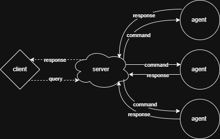

# About

**Selecit** is a distributed query system that operates through agents on remote nodes. It allows you to perform bulk
operations on a cluster of devices using a special query language.

## How it works

All actions with agents are performed through the central server. You can interact with the server using a specialized
client. It's simple: the client sends a request, and the server polls the agents for current data and makes a selection.



## Settings

The server supports TLS and token authentication, which are disabled by default. To enable them, you need to create a
config file for the server and agent, `server.kdl` and `agent.kdl` files, respectively.

### Address

You can specify which address and port the server will listen on. To do this, add a `server` node with the following
content to `server.kdl`. The default server port is **1299**.

```kdl
server {
    address "127.0.0.1"
    port 8080
}
```

You must specify the server address in the `agent.kdl` file.

```kdl
server "localhost" 1299
```

### TLS

In order to enable TLS support on the server, you need a CA and a server certificate, and then specify the paths to
them. Both absolute paths and relative paths from the executable file are accepted.

```kdl
certificates {
    server-cert "server-cert.pem"
    server-key "server-key.pem"
}
```

In `agent.kdl`, you also need to specify the path to the CA file.

```kdl
certificate "./ca-cert.pem"
```

### Token

To enable token authentication, you need to specify the token in the server and agent configuration files.

```kdl
auth {
    token "super-puper-secret-token-change-me"
}
```

## Query language

Currently, the query language is very simple and supports only two expressions:

```sql
list by <field> where <condition>
from <agent_name> select <function>(<args>)
```

### Examples:

Select all agents that have the `version` module and whose version is 0.1.0.

```sql
list by name where info(type = modules).info = "version" & version().version = "0.1.0"
```

Execution of commands by a specific agent.

```sql
from agent0123 select info(type = modules), version()
```

## Modules

Modules are currently compiled together with the agent. To add a new module, you need to implement the Module trait and
register it in the registry.

```rust
use crate::modules::{Args, ExecuteResult, Module, ModuleArg};
use std::env;

pub struct EnvExplorer;

#[async_trait::async_trait]
impl Module for EnvExplorer {
    fn name(&self) -> &'static str {
        "env"
    }

    fn description(&self) -> &'static str {
        "Explore environment variables"
    }

    fn args(&self) -> Vec<ModuleArg> {
        vec![ModuleArg {
            name: "name",
            description: "env name",
            required: true,
            default: None,
        }]
    }

    async fn execute(&self, args: Args) -> ExecuteResult {
        let Some(name) = args.get("name")
        else {
            return ExecuteResult {
                code: 1,
                output: vec!["no 'name' argument".to_owned()],
            };
        };

        if let Ok(value) = env::var(name) {
            ExecuteResult {
                code: 0,
                output: vec![value],
            }
        } else {
            ExecuteResult {
                code: 1,
                output: vec![format!("env '{name}' variable not found")],
            }
        }
    }
}

#[tokio::main]
async fn main() {
    let registry = ModulesRegistry::default();

    registry
        .build(|builder, registry| {
            builder
                .register(AgentVersionModule)
                .register(GetInfoModule::new(registry.clone()))
                .register(EnvExplorer);
        })
        .await;

    // ...
}
```

## Build

The project has no unnecessary dependencies, so you can run it using the standard cargo tool.

```bash
cargo build -r
```

## Run client

You can launch the client using the connect command and then specify the server details.

```bash
client-tui connect <server_address> [<server_port>]
```

Additional parameters can be viewed using the command:

```bash
client-tui connect --help
```

## License

No license, complete freedom, you can do whatever you want with this project.